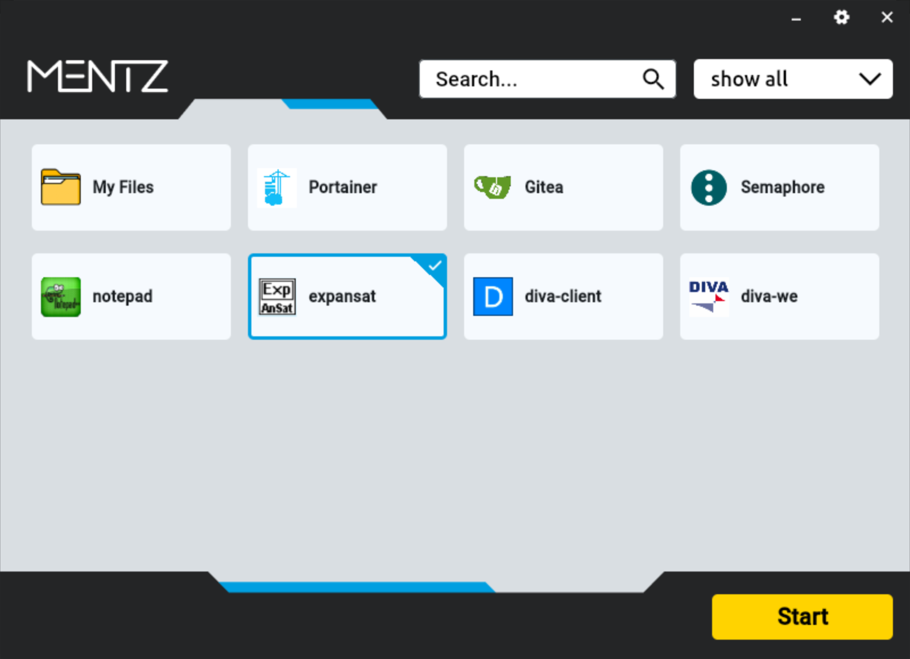

# AppStreamControlPanel

**AppStreamControlPanel** is a Flutter application designed to simplify the management and addition of applications within AWS AppStream 2.0. Instead of rebuilding the entire image each time a new application is needed, this control panel dynamically reads application configurations from a JSON file. This allows for flexible and rapid updates to your available application catalog.

---

## The Problem

By default, adding or modifying applications in AWS AppStream 2.0 often involves a cumbersome and time-consuming process:
1.  Start the Image Builder.
2.  Install/configure the application.
3.  Recreate the image.
4.  Update the fleet.
This process can be particularly tedious ("nervig") with frequent changes.

---

## The Solution: AppStreamControlPanel

AppStreamControlPanel bypasses this by serving as a central graphical interface on the AppStream image. It loads a configuration file (e.g., `programs.json`) that lists applications, their executable paths, and any necessary parameters.

Crucially, this JSON file resides **locally on the AppStream instance**, but its content can be dynamically updated:
* A script on the AppStream image can fetch the latest version of this JSON file (e.g., from an S3 bucket or another repository) during session startup.
* Alternatively, a network location (like an S3 bucket mounted via tools like `rclone`, or any other network share) can be mounted to the AppStream instance, and AppStreamControlPanel can be configured in its settings to read the JSON file directly from this mounted path.

Administrators can add new applications simply by updating the source JSON file, without needing to rebuild the entire AppStream image. Users are presented with an intuitive interface showing application icons, which they can click to launch.

---

## ✨ Features

* **Dynamic App Management:** Add, modify, or remove applications by editing a local JSON file.
* **Flexible JSON Sourcing:**
    * Use a startup script to fetch the latest JSON (e.g., from S3).
    * Point the tool to a JSON file on a mounted S3 bucket or any network path (configurable in settings).
* **No Image Rebuild Needed:** For changes to the application catalog.
* **Graphical User Interface:** Displays applications with icons.
* **Application Launching:** Directly starts configured applications with parameters.
* **Search:** Quickly find applications.
* **Filtering:** Filter applications, for example, by group.
* **Multi-language UI:** The AppStreamControlPanel interface supports German and English. (Application names are displayed as defined in the JSON).
* **Logging:** Integrated logging functionality for diagnostic purposes.

---

## ⚙️ How it Works

1.  **Initial Setup:**
    * AppStreamControlPanel (this Flutter application) is installed once on the base AppStream image.
    * A JSON configuration file (e.g., `programs.json`) is prepared.
2.  **JSON File Management (Choose one or adapt):**
    * **Option A (Script-based):** A script on the AppStream image downloads/updates a local copy of `programs.json` (e.g., from S3) when a user session starts. AppStreamControlPanel reads this local file.
    * **Option B (Mounted Path):** An S3 bucket or network share containing `programs.json` is mounted to a specific path on the AppStream instance.
3.  **AppStreamControlPanel Configuration:**
    * Within AppStreamControlPanel's settings, you specify the **local path** to the `programs.json` file.
4.  **In Operation:**
    * When AppStreamControlPanel starts (or refreshes), it reads the specified local `programs.json` file.
    * Applications defined in the JSON are displayed in the GUI.
    * Users can browse, search, filter, and launch these applications.
5.  **Adding/Modifying Applications:**
    * The administrator updates the *source* `programs.json` file (e.g., the one in S3 or on the central network share).
    * The mechanism chosen in step 2 ensures the local `programs.json` on the AppStream instance is updated (e.g., by the script on next session start, or immediately if it's a direct mount).
    * AppStreamControlPanel will then display the updated application list (e.g., on its next refresh or restart).

---

## 🔧 Configuration

### 1. The Application JSON File (e.g., `programs.json`)

This file contains the list of applications. It should be structured as follows:

```json
[
  {
    "name": "My Files",
    "Icon": "myfiles.png",
    "path": "nautilus",
    "parameter": "/home/as2-streaming-user/MyFiles/",
    "group": "Tools",
    "ID": "1"
  },
  {
    "name": "Portainer",
    "Icon": "portainer.png",
    "path": "/usr/bin/firefox",
    "parameter": "https://portainer.example.com/#!/auth",
    "group": "Web Apps",
    "ID": "2"
  },
  {
    "name": "Gitea",
    "Icon": "gitea.png",
    "path": "/usr/bin/firefox",
    "parameter": "https://gitea.example.com",
    "group": "Development",
    "ID": "3"
  },
  {
    "name": "Custom App X",
    "Icon": "appx_icon.png",
    "path": "/opt/custom_apps/appx/run.sh",
    "parameter": "--config /opt/custom_apps/appx/config.ini",
    "group": "Business Apps",
    "ID": "4"
  }
]
```

## 📸 Screenshot



## 🤝 Contributing

Contributions are welcome! Please feel free to create an Issue to report bugs or suggest new features. If you'd like to contribute code, please open a Pull Request.